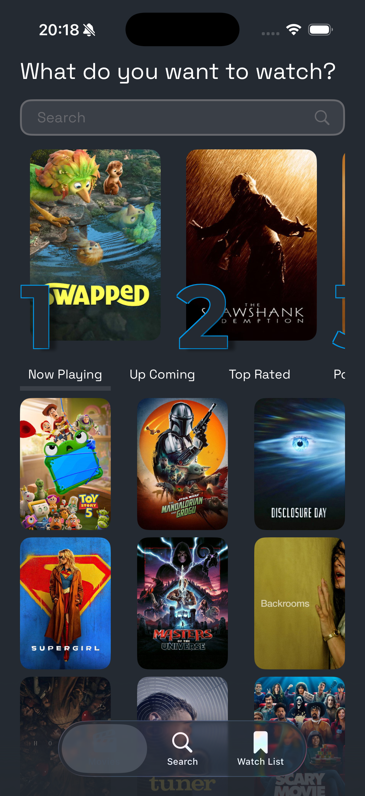
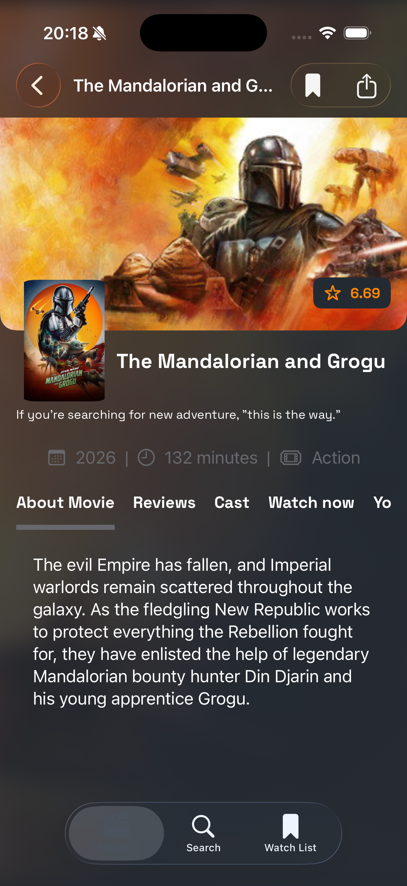
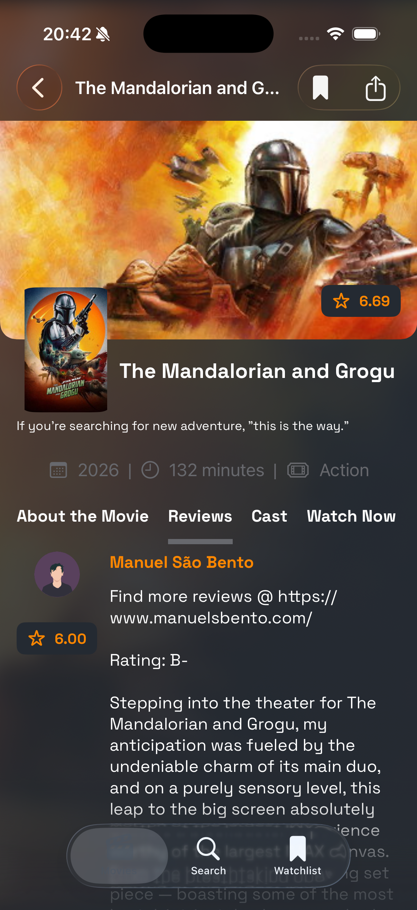
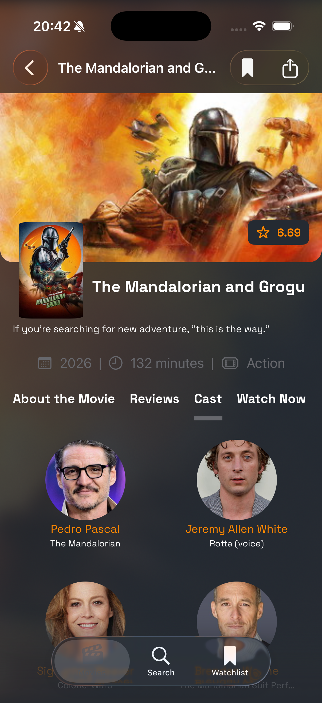
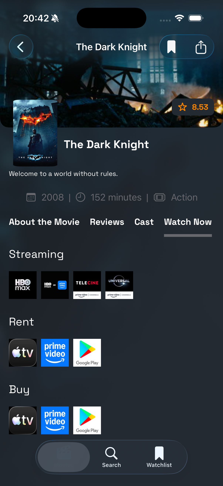
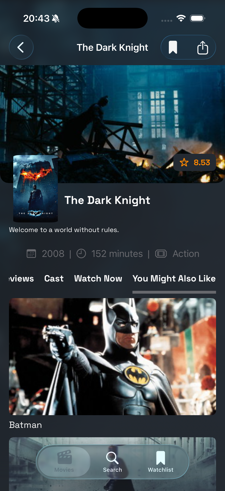

# MovieBrowser

Aplicativo iOS em SwiftUI para explorar o catálogo do TMDB, pesquisar filmes, abrir detalhes, ver elenco, reviews, recomendações, provedores de streaming e manter uma lista local de favoritos.

O projeto foi estruturado como uma aplicação de catálogo com separação clara entre apresentação, domínio e infraestrutura. A configuração do Xcode é declarativa via XcodeGen e o módulo compartilhado `Core` fica isolado como Swift Package.

|   |   |   |
|---|---|---|
|  |  |  |
|  |  |  |

## Stack

- Swift 6
- SwiftUI
- Combine para publicação de estado nas ViewModels
- Swift Concurrency com `async/await`
- SwiftData para persistência da watchlist
- Swift Package Manager para o módulo `Core`
- XcodeGen para gerar o `.xcodeproj`
- SwiftLint e SwiftFormat em build scripts
- Swift Testing nos testes do módulo `Core`

## Estrutura do Repositório

```text
.
├── project.yml
├── project.options.yml
├── makefile
└── Source
    ├── Core
    │   ├── Sources/Core
    │   └── Tests/CoreTests
    ├── MovieBrowser
    │   ├── Source/App
    │   ├── Source/Domains
    │   ├── Source/Infrastructure
    │   ├── Source/Presentation
    │   ├── Resources
    │   └── Supporting
    ├── MovieBrowserTests
    ├── MovieBrowserUITests
    ├── project.targets.yml
    ├── project.packages.yml
    ├── project.schemes.yml
    └── project.templates.yml
```

## Arquitetura

O app segue uma arquitetura em camadas com MVVM na apresentação e dependências orientadas por protocolos.

### App

`Source/MovieBrowser/Source/App` concentra o ponto de entrada e a composição inicial:

- `MovieBrowserApp` inicializa a aplicação SwiftUI, aplica o tema escuro e injeta o `AppContainer`.
- `RootView` controla o estado inicial de splash/carregamento.
- `ContentView` organiza as abas principais: filmes, busca e watchlist.
- `HomeRouter` usa `NavigationStack` por fluxo para abrir detalhes de filmes e limpar navegação ao trocar de aba.

### Presentation

`Source/MovieBrowser/Source/Presentation` contém telas, componentes reutilizáveis, estados de UI e ViewModels.

As ViewModels são `@MainActor`, expõem estado por `@Published` e dependem de contratos:

- `HomeViewModel` carrega conteúdo inicial e paginação por categoria.
- `SearchViewModel` executa busca, carrega gêneros sob demanda e pagina resultados.
- `MovieDetailViewModel` coordena detalhes, preview de imagem, reviews, elenco, recomendações, provedores e bookmark.
- `WatchListViewModel` lê a lista persistida de favoritos.

Cada tela possui um protocolo de ViewModel em `ViewModel/Contract`, o que facilita mocks, previews e testes.

### Domain

`Source/MovieBrowser/Source/Domains` representa a regra de aplicação:

- `Model`: modelos usados pela UI e pelos casos de uso.
- `UseCase`: operações como buscar home, detalhes, reviews, cast, recomendações, provedores, gêneros, pesquisa e inserir/remover bookmark.
- `Interfaces`: contratos de repositórios que blindam o domínio contra detalhes de rede, cache ou persistência.

Os UseCases recebem protocolos de repositório e mantêm a camada de domínio independente da implementação concreta. Um exemplo é `FetchMovieDetailUseCase`, que busca os detalhes remotos e cruza o resultado com a watchlist local para marcar `isBookmark`.

### Infrastructure

`Source/MovieBrowser/Source/Infrastructure` contém implementações concretas:

- `Repository`: chamadas remotas e persistência local.
- `Endpoint`: definição de rotas do TMDB e montagem de query params.
- `Dto`: contratos de resposta da API.
- `Adapter`: conversão de DTOs ou entidades SwiftData para modelos de domínio.
- `Storage`: acesso ao SwiftData para watchlist.
- `Service`: carregamento de imagens.
- `Container` e `Builder`: composição das dependências por feature.
- `Environment`: leitura de chaves e URLs do `Info.plist`.

O `AppContainer` cria os clientes HTTP, caches, serviço de imagem, `ModelContainer` do SwiftData e a `ViewModelContainerFactory`. A factory delega a montagem de cada fluxo para builders específicos, mantendo a inicialização fora das Views.

### Core

`Source/Core` é um Swift Package independente com utilitários compartilhados:

- `ApiClient`, implementado como `actor`, para execução assíncrona de requests.
- `Endpoint`, `HTTPMethod` e contratos de networking.
- `PinnedSessionDelegate` para SSL pinning por hash SHA-256 da SubjectPublicKeyInfo.
- `Reachability` para checagem de conectividade.
- `ResourceCacheProvider` para cache em memória.
- extensões de `Bundle`, `Date`, `Int`, `String` e `UIImage`.

O módulo possui testes próprios para `ApiClient`, SSL pinning e extensões.

## Fluxo de Dados

O fluxo principal segue esta direção:

```text
SwiftUI View
  -> ViewModelProtocol
  -> ViewModel
  -> UseCaseProtocol
  -> UseCase
  -> RepositoryProtocol
  -> Repository / DataSource
  -> ApiClient, SwiftData ou Cache
```

Para respostas remotas, os repositórios decodificam DTOs e usam adapters antes de devolver modelos de domínio:

```text
TMDB API -> DTO -> Adapter -> Domain Model -> UseCase -> ViewModel State -> View
```

## Features Implementadas

- Home com categorias de filmes: em cartaz, populares, mais bem avaliados e próximos lançamentos.
- Paginação de catálogo por categoria.
- Busca de filmes com paginação.
- Detalhe do filme com informações, imagem, elenco, reviews, recomendações e provedores.
- Favoritos/watchlist local com SwiftData.
- Cache em memória para imagens e dados auxiliares.
- Previews com mocks e fixtures JSON em `Supporting/Preview Content`.
- UI em modo escuro, orientação portrait e fontes customizadas.
- Localização via String Catalog em `Resources/Localizable.xcstrings`.

## Networking e Segurança

A comunicação com o TMDB usa o módulo `Core`:

- `Endpoint` monta URL, método, headers, query params e body.
- `ApiClient` valida conectividade, resposta HTTP e status code 2xx.
- `ApiClientFactory` cria sessões com `PinnedSessionDelegate`.
- O pinning fixa o hash SHA-256 da chave pública SPKI, não o certificado inteiro.
- O `make generate` calcula os pins atuais de `api.themoviedb.org` e `image.tmdb.org` via `openssl` e injeta nos `.xcconfig`.

As chaves e URLs são lidas do `Info.plist` por `AppEnvironment`, com valores vindos dos arquivos `.xcconfig` gerados.

## Configuração

Crie os arquivos de ambiente na raiz do repositório antes de gerar o projeto:

```text
.env
.env.Debug
```

Eles devem fornecer os valores usados pelo `project.yml` e pelo `Info.plist`, por exemplo:

```text
BUNDLE_ID_PREFIX = com.seu.bundle
DEVELOPMENT_TEAM = SEU_TEAM_ID
API_BASE_URL = https://api.themoviedb.org
IMG_HOST = https://image.tmdb.org
HOST = https://www.themoviedb.org
API_KEY = sua_api_key
API_TOKEN = seu_token
```

Depois gere o projeto:

```bash
make generate
```

Abra no Xcode:

```bash
make open
```

Ou execute o fluxo completo:

```bash
make start
```

## Comandos

| Comando | Descrição |
| --- | --- |
| `make install` | Instala SwiftLint, SwiftFormat e XcodeGen via Homebrew. |
| `make clean` | Remove projeto gerado, DerivedData e artefatos de build. |
| `make setup` | Executa instalação de ferramentas e limpeza. |
| `make generate` | Gera `.xcconfig`, injeta pins SSL e cria o `.xcodeproj` via XcodeGen. |
| `make open` | Abre `Source/MovieBrowser.xcodeproj` no Xcode. |
| `make start` | Executa setup, generate e open. |
| `make reset` | Limpa tudo e recria o ambiente. |

## Qualidade e Testes

SwiftLint e SwiftFormat são aplicados por scripts em `Source/Scripts` configurados no template `LintAndFormat` do XcodeGen.

Para testar o pacote `Core`:

```bash
cd Source/Core
swift test
```

Os testes do app e de UI ficam em:

- `Source/MovieBrowserTests`
- `Source/MovieBrowserUITests`

## Decisões de Engenharia

- XcodeGen evita versionar `.pbxproj` e reduz conflitos na configuração do projeto.
- O pacote `Core` isola networking, cache e extensões reutilizáveis.
- UseCases protegem a regra de negócio de detalhes de rede e persistência.
- Repositórios e DataSources ficam atrás de protocolos para facilitar mocks.
- Builders por feature centralizam composição de dependências e mantêm Views simples.
- DTOs não vazam para a apresentação; adapters fazem a tradução para modelos de domínio.
- SwiftData é usado apenas na infraestrutura local da watchlist.
- SSL pinning por SPKI reduz acoplamento ao certificado específico e mantém validação forte da chave pública.
